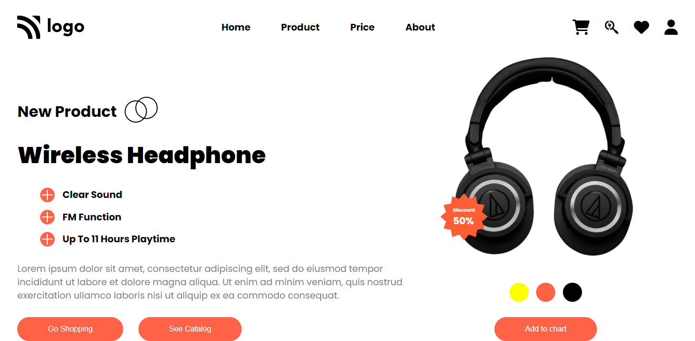

## 🔗 Street Style Landing Page
[https://vishal-product-home-page-html-css.netlify.app/](https://vishal-product-home-page-html-css.netlify.app/)

## ⭐ Street Style Landing Page ⭐

This is the assignment given in the **"JavaScript Full Stack Web Developer Bootcamp"** by **iNeuron** *&* This Assignment was done using **HTML5 & CSS3.**

### 📌 Tech Stack

&nbsp; &nbsp;

### 📌 Overview

### 📌 What I Learn

> 👉 Flexbox and Grid   
  👉 Linking External CSS   
  👉 Concept of z-index   
  👉 **CSS Pseudo Selectors**   
  👉 Position in CSS  
  👉 Targeting Parent and Child elements  
  👉 Page distribution horizontally and vertically   

### Time Taken to Complete this Project:- 3 Hours

### 📬 Connect With Me

- **LinkedIn** - [Vishal Rikhi](https://www.linkedin.com/in/vishal-rikhi/)

### 📌 Acknowledgement

- **Course Instructor** - [Hitesh Choudhary](https://www.linkedin.com/in/hiteshchoudhary/)

